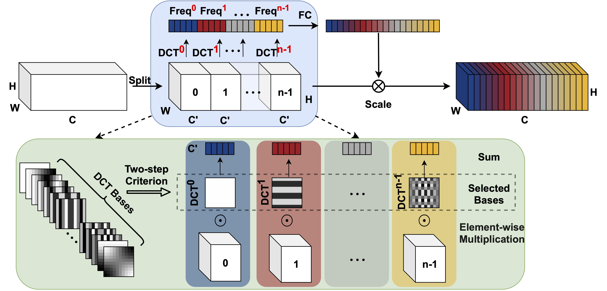

# FcaNet: Frequency Channel Attention Networks
PyTorch implementation of the paper "[FcaNet: Frequency Channel Attention Networks](https://arxiv.org/abs/2012.11879)".


# Install
Please see [INSTALL.md](./INSTALL.md)

# Simplest usage

Models pretrained on ImageNet can be accessed by:
```
model = torch.hub.load('cfzd/FcaNet', 'fca34' ,pretrained=True)
model = torch.hub.load('cfzd/FcaNet', 'fca50' ,pretrained=True)
model = torch.hub.load('cfzd/FcaNet', 'fca101' ,pretrained=True)
model = torch.hub.load('cfzd/FcaNet', 'fca152' ,pretrained=True)
```


# Evaluation
Due to the conversion between FP16 training and the provided FP32 models, the evaluation results are slightly different(max -0.06%/+0.05%) compared with the reported results.
|  Model | Reported | Evaluation Results | Link |   
|:--------:|:------------:|:----------------:|:-------------------:|
| Fca34 |     75.07    |       75.02      |          [GoogleDrive](https://drive.google.com/file/d/1zTbhu1ynShAG9qH_HKJfOQeWBWVD9dCW/view?usp=sharing)/[BaiduDrive(code:m7v8)](https://pan.baidu.com/s/1ylq_tJaRlCSHhDcmVinnfA) |
|  Fca50  |     78.52     |       78.57       |          [GoogleDrive](https://drive.google.com/file/d/1O7qtqHSXdwRzUv_m6wrqB4TVF-rqJInB/view?usp=sharing)/[BaiduDrive(code:mgkk)](https://pan.baidu.com/s/1yrZYotYYGCFU7as_6h8GZw) |
|  Fca101  |    79.64    |       79.63       |          [GoogleDrive](https://drive.google.com/file/d/11CydGJ_dzjdOn9Z3E00enc125SpFJD8k/view?usp=sharing)/[BaiduDrive(code:8t0j)](https://pan.baidu.com/s/1SPE7_uxbKLz9s1k97fRl5Q) |
|  Fca152  |     80.08     |       80.02       |          [GoogleDrive](https://drive.google.com/file/d/1rtNAmePV4dIpTEkLCT08p6yiRyH0FC3B/view?usp=sharing)/[BaiduDrive(code:5yeq)](https://pan.baidu.com/s/1rLtkHIDqks4jSIq0Nqt-fQ) |

To evaluate, run
```
export NGPUS=4

python -m torch.distributed.launch --nproc_per_node=$NGPUS main.py \
 -e \
 --b 128 \
 --dali_cpu \
 -a fcanet34 \ # also can be 50,101,152
 --evaluate_model /path/to/your/downloaded/model \
 /path/to/your/ImageNet
```

Or please see `launch_eval.sh`

# FAQ
Since the paper is uploaded to arxiv, many academic peers ask us: the proposed DCT basis can be viewed as a simple tensor, then how about learning the tensor directly? Why use DCT instead of learnable tensor? Learnable tensor can be better than DCT.

Our concrete answer is: **the proposed DCT is better than the learnable way, although it is counter-intuitive.**

| Method                                      |      ImageNet Top-1 Acc   | Link |
|---------------------------------------------|:-------------:|:----------:|
| Learnable tensor, random initialization | 77.914 |        [GoogleDrive](https://drive.google.com/file/d/1KsiSuyHNtIxBEabdaDT_0Lt5foSNBgtb/view?usp=sharing)/[BaiduDrive(code:p2hl)](https://pan.baidu.com/s/1IBavAQ-GnvElqJBY6oblWg)     |
| Learnable tensor, DCT initialization    |     78.352     |      [GoogleDrive](https://drive.google.com/file/d/1CwpW0lRwU7uXEf8ldm4hJUs-9O33MKfI/view?usp=sharing)/[BaiduDrive(code:txje)](https://pan.baidu.com/s/1CC2j9tjySH-GGZ9oM7cpjA)       |
| Fixed tensor, random initialization     | 77.742 |        [GoogleDrive](https://drive.google.com/file/d/1jRXX4QqYsU8wyOHWW34qVF0DuLZ3R884/view?usp=sharing)/[BaiduDrive(code:g5t9)](https://pan.baidu.com/s/1HpJyi9h6L0_rvEg218JK9g)     |
| Fixed tensor, DCT initialization (Ours) |     78.574     |     [GoogleDrive](https://drive.google.com/file/d/1O7qtqHSXdwRzUv_m6wrqB4TVF-rqJInB/view?usp=sharing)/[BaiduDrive(code:mgkk)](https://pan.baidu.com/s/1yrZYotYYGCFU7as_6h8GZw)        |


To verify this results, one can select the cooresponding types of tensor in the L73-L83 in `model/layer.py`, uncomment it and train the whole network.


# Training
Please see `launch_training.sh`

# TODO
- [ ] Object detection models 
- [ ] Instance segmentation models
- [ ] Make the switching between configs more easier 
